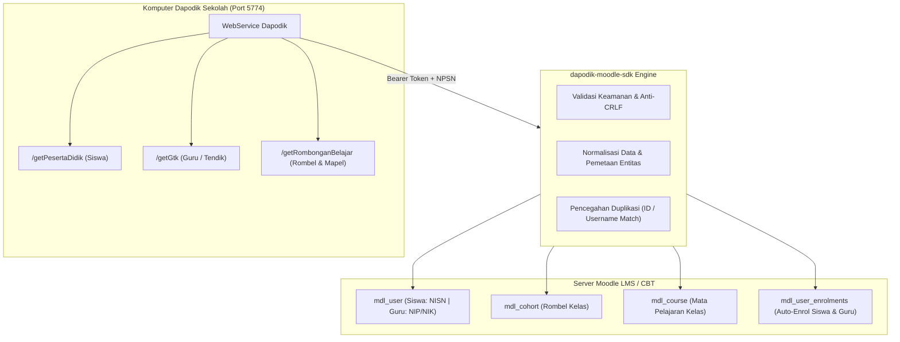

<p align="center">
  
</p>

<h1 align="center">dapodik-moodle-sdk</h1>

<p align="center">
  <a href="https://moodle.org"></a>
  <a href="https://php.net"></a>
  <a href="https://opensource.org/licenses/MIT"></a>
  <a href="https://www.instagram.com/smansagewithai/"></a>
</p>

<p align="center">
  Solusi terpadu integrasi dan sinkronisasi otomatis antara <b>WebService Dapodik Kemendikdasmen</b> (port 5774) dengan platform <b>LMS & CBT Moodle</b>.
</p>

<p align="center">
  Dipublikasikan dan dikelola oleh <b>SMA Negeri 1 Gedeg (<a href="https://www.instagram.com/smansagewithai/">@smansagewithai</a>)</b><br />
  Dikembangkan oleh <b>Ryan Ardian</b>
</p>

---

> [!IMPORTANT]
> ### 📢 Pernyataan Penyangkalan (Disclaimer) & Misi Terbuka
> **`dapodik-moodle-sdk` adalah pustaka *Unofficial* (tidak resmi) dan independen.** Pustaka ini dikembangkan sebagai inisiatif komunitas sumber terbuka (*open-source*) oleh **SMA Negeri 1 Gedeg** dan **Ryan Ardian**, tanpa afiliasi langsung secara struktural dengan Kementerian Pendidikan Dasar dan Menengah (Kemendikdasmen) maupun Moodle Pty Ltd.
>
> **Tujuan & Misi Pengembangan**:
> Pustaka ini diciptakan khusus untuk **meringankan beban teknis para proktor, operator sekolah, dan tim IT sekolah** di seluruh Indonesia dalam mengelola akun ujian CBT dan LMS E-Learning. Dengan SDK ini, ribuan akun siswa, guru, rombongan belajar, dan mata pelajaran dari Dapodik lokal dapat disinkronkan ke Moodle secara instan tanpa perlu unggah CSV manual yang melelahkan dan rentan kesalahan.
>
> Seluruh hak cipta nama, logo, dan merek dagang **Dapodik (Data Pokok Pendidikan)** adalah milik sah **Kementerian Pendidikan Dasar dan Menengah Republik Indonesia**, dan merek **Moodle** adalah milik sah **Moodle Pty Ltd**.

---

## ⚙️ 1. Bagaimana Cara Kerjanya? (Arsitektur & Alur Kerja)

Integrasi Dapodik ke Moodle bekerja dengan menghubungkan data dari database Dapodik lokal sekolah (melalui REST WebService desktop port 5774) dan memetakannya (*mapping*) ke dalam struktur basis data Moodle:



---

### 🧠 Logika Pemetaan Cerdas (*Smart Entity Mapping*):

| Data di Dapodik | Pemetaan di Moodle LMS | Keterangan Aturan |
| :--- | :--- | :--- |
| **Peserta Didik (Siswa)** | Akun Pengguna (`mdl_user`) | **Username**: NISN siswa (unik & mudah diingat).<br />**Password**: Password default seragam sekolah.<br />**Email**: Email Dapodik / fallback `@sekolah.sch.id`. |
| **GTK (Guru Pengajar)** | Akun Pengguna (`mdl_user`) | **Username**: NIP atau NIK.<br />**Role**: Otomatis diberi peran *Editing Teacher* pada mapel yang diampu. |
| **Rombongan Belajar** | Moodle Cohort (`mdl_cohort`) | Nama Rombel (misal: *X-A, XI-MIPA 1*) dijadikan Cohort. Siswa rombel otomatis didaftarkan sebagai anggota cohort. |
| **Pembelajaran (Mapel)** | Moodle Course (`mdl_course`) | Setiap mata pelajaran per rombel otomatis menjadi 1 Course.<br />Guru mapel dan siswa rombel otomatis terdaftar (*auto-enrol*). |

---

## 🚀 2. Dua Mode Penggunaan

Repositori ini menyediakan **2 Pilihan Mode** sesuai kebutuhan infrastruktur sekolah Anda:

### 🔌 MODE 1: Plugin Native Moodle (`local_dapodik`)
*Paling direkomendasikan jika Anda memiliki akses administrator ke server Moodle.*

1. Salin folder `moodle-plugin/` ke direktori instalasi Moodle Anda di:
   ```bash
   moodle/local/dapodik/
   ```
2. Buka browser dan login ke Moodle sebagai Administrator.
3. Kunjungi halaman **Site Administration ➔ Notifications** untuk menyelesaikan instalasi otomatis plugin.
4. Buka **Site Administration ➔ Plugins ➔ Local plugins ➔ Integrator Dapodik Kemendikdasmen** untuk mengisi Token & IP Dapodik.
5. Buka menu **Pusat Kendali Dapodik** di Moodle:
   * **Tab 1: ⚡ Penarikan Bertahap (Modular Sync)**:
     - Berikan centang hanya pada data yang ingin ditarik (Siswa saja, Guru saja, Rombel saja, atau Mapel saja).
     - Centang atau kosongkan opsi *"Otomatis Daftarkan Guru Pengampu dari Dapodik"* jika ingin pembagian tugas dilakukan terpisah.
   * **Tab 2: 👨‍🏫 Pemetaan Pengajar (Teacher Assignment Dashboard)**:
     - Menampilkan tabel seluruh mata pelajaran per kelas.
     - Menampilkan nama guru dari Dapodik.
     - Sedia dropdown untuk memilih dan mendaftarkan guru manapun di Moodle (baik guru PNS, P3K, maupun guru honorer lokal) ke kelas bersangkutan dengan 1 klik!

---

### 🌐 MODE 2: Standalone CLI Bridge (`bin/dapodik-moodle`)
*Sangat cocok jika server Moodle berada di Cloud/Hosting luar dan Anda ingin menjalankan sinkronisasi dari laptop/server lokal sekolah.*

1. Masuk ke folder `standalone-bridge`:
   ```bash
   cd standalone-bridge
   composer install
   ```
2. Siapkan file konfigurasi:
   ```bash
   cp config/config.example.php config/config.php
   ```
3. Edit `config/config.php` dengan URL Moodle, Token WebService Moodle, NPSN, dan Token Dapodik.
4. Jalankan perintah sinkronisasi granular melalui terminal:
   ```bash
   # Uji koneksi ke Dapodik dan Moodle
   ./bin/dapodik-moodle test:connection

   # 1. Tarik Rombel & Mapel saja (tanpa paksa guru Dapodik)
   ./bin/dapodik-moodle sync:cohorts
   ./bin/dapodik-moodle sync:courses

   # 2. Tarik Siswa saja
   ./bin/dapodik-moodle sync:students

   # 3. Tarik Guru saja
   ./bin/dapodik-moodle sync:teachers

   # 4. Assign guru tertentu ke suatu course (Course ID & User ID)
   ./bin/dapodik-moodle assign:teacher 45 12
   ```

---

## 🛡️ 3. Keamanan & Kepatuhan Hukum

1. **Kepatuhan UU PDP No. 27 Tahun 2022**:
   - SDK ini tidak menyimpan (*caching*) atau merekam data sensitif siswa (NIK, nomor telepon, data orang tua) ke media penyimpanan eksternal.
   - Kredensial token tersimpan aman di database konfigurasi lokal Moodle.
2. **Hardened Security**:
   - Terlindungi dari serangan **CRLF Header Injection** pada token dan parameter query.
   - Terlindungi dari **Path Traversal Attacks** (`..` / `\`).
   - Dilengkapi batas waktu (*timeout*) ketat agar server tidak mengalami *hanging*.

---

## ⚖️ 4. Lisensi & Ketentuan Penggunaan Non-Komersial

Proyek ini dirilis di bawah lisensi **[MIT License with Non-Commercial Restriction (MIT-NC)](LICENSE)**.

### 📌 Ketentuan Penggunaan:
1. **100% Gratis untuk Pendidikan**: Pustaka ini sepenuhnya **gratis** digunakan oleh seluruh sekolah, madrasah, guru, operator, proktor, siswa, dan lembaga pendidikan di Indonesia.
2. **Dilarang untuk Tujuan Komersial (Non-Commercial Only)**:
   - Dilarang keras memperjualbelikan, memonetisasi, menjual kembali (*reselling*), atau mengemas SDK/Plugin ini ke dalam produk berbayar tanpa izin tertulis dari pemegang hak cipta (**Ryan Ardian & SMA Negeri 1 Gedeg**).
3. **Atribusi Hak Cipta**:
   - Hak Cipta &copy; 2026 **Ryan Ardian** ([inisaya@ardianryan.com](mailto:inisaya@ardianryan.com)) & **SMA Negeri 1 Gedeg** ([@smansagewithai](https://www.instagram.com/smansagewithai/)).
